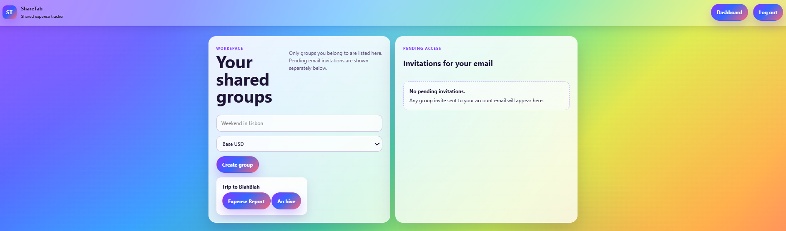
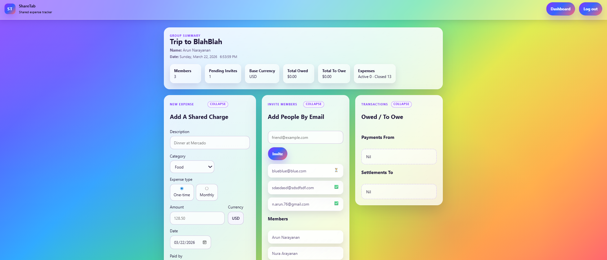
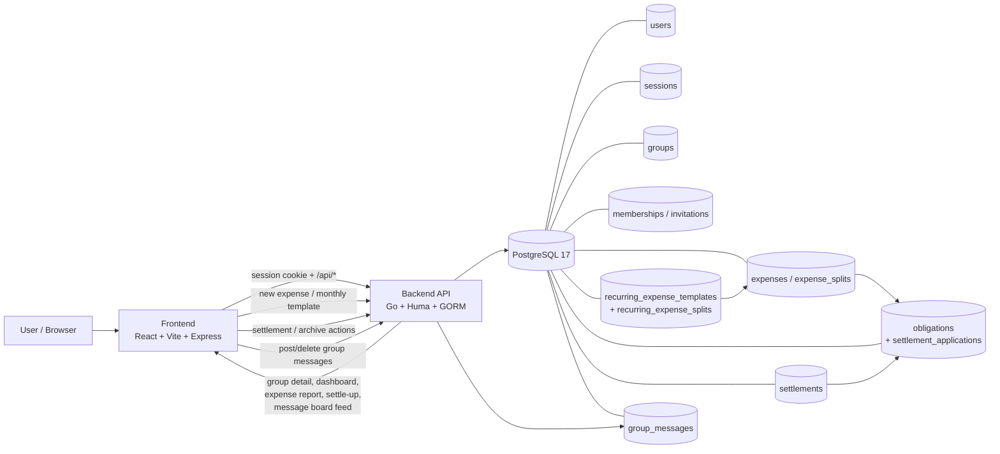

<a id="top"></a>

# Table of Contents
- [Description](#description)
- [Main Features](#main-features)
- [Tech Stack](#tech-stack)
- [Data Model](#data-model)
- [Architecture Diagram](#architecture-diagram)
- [Run with Docker](#run-with-docker)
- [Local Development](#local-development)
- [Development Attribution](#development-attribution)
- [Special Notes](#special-notes)

## Description

An expense tracker for trips, roommates, and friend groups. It can also be used to track monthly expenditure.

### Dashboard View


### Group View


[Back to top](#top)

## Main Features
- Email/password registration, login, logout, and persistent cookie sessions
- Public landing page with protected dashboard and group routes
- Strict per-user access control for all group reads and writes
- Group creation with invitation-by-email workflow
- Dashboard filtered to only the current user's groups
- Group detail view with members, invitations, expenses, balances, settlements, and group chat
- One-time and monthly shared expenses with equal/custom splits
- Auto-calculated direct and simplified settle-up suggestions
- Expense reporting for group activity, status, category, type, split details, and payment timing

[Back to top](#top)

## Tech Stack
- Frontend: React, React Router, Vite, Express
- Backend: Go, Huma, GORM
- Database: PostgreSQL 17
- Runtime: Docker, Docker Compose
- Test runtime: Docker Compose cached Go test image

[Back to top](#top)

## Data Model
- `users`: registered users with email, display name, password hash, and audit timestamps
- `sessions`: persistent login sessions keyed by hashed tokens with expiry
- `groups`: expense-sharing groups with creator, base currency, and archive state
- `memberships`: per-group membership rows with owner/member role tracking
- `invitations`: email invitations with acceptance status and token-based join flow
- `expenses`: one-time expense rows and generated monthly occurrence rows, including category, type, payer, optional owner, occurrence month, FX/base-currency values, and archive state
- `expense_splits`: per-expense participant shares used for equal/custom splitting
- `recurring_expense_templates`: monthly recurring payment templates with due day, browser time zone, owner, split mode, and start month
- `recurring_expense_splits`: per-template participant shares used to generate each monthly occurrence
- `settlements`: direct-expense and netted/transitive payments between members
- `settlement_allocations`: legacy expense-linked settlement rows retained for compatibility
- `obligations`: canonical open-debt ledger between users, sourced from expense splits or reimbursement flows
- `settlement_applications`: links showing how settlement amounts close obligation rows
- `group_messages`: message-board posts visible to group members inside each group, storing author, body, and timestamps for the group chat panel

Core accounting flow:
- Creating an expense produces participant split rows and open obligations
- Creating a monthly template materializes monthly expense occurrences through the current browser-local month
- Creating a settlement applies money against obligations, either directly or through netted execution
- Posting to group chat creates a `group_messages` row scoped to the group and current member
- Loading a group returns the current message-board feed along with balances, expenses, and membership state
- Expense reports are generated from expenses plus obligation/settlement state

[Back to top](#top)

## Architecture Diagram


[Back to top](#top)

## Run with Docker
1. Copy `.env.example` to `.env` if you want to override defaults:
   ```bash
   cp .env.example .env
   ```
2. Create local Docker secret files and update your `.env` file accordingy:
   ```bash
   mkdir -p <secdir>
   <secdir>/db_name
   echo "XXXXXXXXXXXXXXXXX" > <secdir>/db_name
   echo "XXXXXXXXXXXXXXXXX" > <secdir>/db_user
   echo "XXXXXXXXXXXXXXXXX" > <secdir>/db_password
   cat >> .env << EOF
   DB_NAME=${pwd}/<secdir>/db_name
   DB_USER=${pwd}/<secdir>/db_user
   DB_PASSWORD=${pwd}/<secdir>/db_password
   EOF
   ```
3. Create the volume directory and update your `.env` file accordingy:
   ```bash
   mkdir -p <voldir>
   chown -R 70:70 <voldir>
   chmod -R 700 <voldir>
   cat >> .env << EOF
   DB_VOLUME=${pwd}/<db-vol-dir>
   EOF
   ```
4. Start the stack in the repo root:
   ```bash
   docker compose -f docker-compose.yml --env-file .env up --build --detach
   ```
5. The expense tracker will be available `http://localhost:8082`.
6. Stop the stack from the repo root:
   ```bash
   docker compose -f docker-compose.yml --env-file .env down
   ```

[Back to top](#top)

## Local Development
Local development is centered on the Docker Compose stack.

**Configuration**

- `DB_HOST`, `DB_PORT`: PostgreSQL connection values
- `BACKEND_PORT`: backend host/container port
- `FRONTEND_PORT`: frontend host/container port
- `SESSION_COOKIE_NAME`: cookie name for persistent sessions
- `SESSION_TTL_HOURS`: session lifetime in hours
- `APP_ORIGIN`: origin-aware app setting, including secure-cookie behavior for `https://...`

**Main files and services**

- [docker/frontend/](docker/frontend): React app, styling, group UX, and Express server
- [docker/backend/](docker/backend): Go API, auth/session handling, expense logic, settlements, reporting, and messaging
- [docker-compose.yml](docker-compose.yml): local app topology and Docker workflows

**Verification**

- Build backend and frontend images with:
  ```bash
  docker compose up --build --no-start --no-deps expense-tracker-backend expense-tracker-frontend
  ```
- Run the cached Dockerized Go backend suite with:
  ```bash
  docker compose --profile test up --build --abort-on-container-exit --exit-code-from expense-tracker-backend-test expense-tracker-backend-test
  ```
- The test image prewarms Go module and build caches during the Docker build so each run does not start from a cold `go-sqlite3` CGO compile
- Manual verification should cover auth, group access, expense creation, settlement handling, reporting, and archived-group restrictions

[Back to top](#top)

## Development Attribution
- Principal developer: Codex (GPT-5 coding agent).
- Collaboration model: iterative prompt-driven development in the local repo with incremental implementation, debugging, testing, and UI refinement.

### Prompt Summary (Consolidated)

- Run the application locally with Docker Compose using PostgreSQL, a Go backend, and a React frontend served through Express.
- Support persistent cookie-based authentication, protected dashboard/group routes, and strict per-user access control.
- Build group workflows for creation, membership, invitations, and archived-group handling.
- Track one-time shared expenses with equal/custom splits, payer selection, ownership, and expense reporting.
- Redesign settlement handling around an obligation ledger so direct and netted/transitive payments settle balances consistently across reads and reports.
- Add monthly recurring payments using recurring templates plus generated monthly expense occurrences based on the browser time zone and due day.
- Keep expense reporting aligned with current product semantics, including expense category, type, `PayByDate`, split status, and group expenditure totals.
- Add a group message board so owners and members can post and delete their own in-group messages.
- Refine the `/groups` experience with collapsible panels, archived-group blocked states, responsive grid placement, and a persistent rainbow visual style.
- Maintain Dockerized verification workflows for backend tests and image builds while iterating on backend logic, frontend behavior, and documentation.

[Back to top](#top)

## Special Notes

[Back to top](#top)
